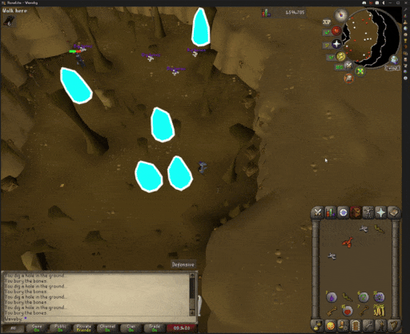
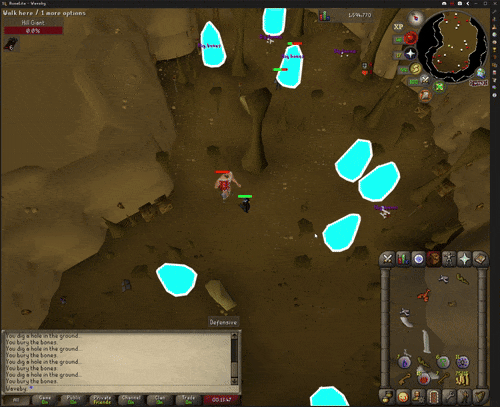

# JAKE BOT 2000


A Python-based RuneScape bot with human-like mouse movement based on my dear friend Jake

Automatic attacking


Automatic loot pickup (and burying bones)


## Features

- Human-like mouse movement using combinations of real mouse paths
- Automatic target detection and combat
- Loot pickup using clustering algorithms
- Auto bury bones wahoooo
- Auto-eating when health is low
- Random breaks between mob kills, and long breaks approx every 30 minutes
- Random, realistic mouse movement  

## Dependencies

- Python 3.9+
- NumPy, SciPy, scikit-learn
- OpenCV, Pillow (image processing)
- PyAutoGUI, PyDirectInput (automation)
- pywin32 (Windows integration)

Runelite must be setup with a few plugins for all this to work too :p

## Installation

1. Clone the repository:
```bash
git clone https://github.com/tytrusty/jake-bot-3000.git
cd jake-bot-3000
```

2. Create and activate the conda environment:
```bash
conda env create -f environment.yml
conda activate jake
```

3. Install the package in development mode:
```bash
pip install -e .
```

## Quick Start

1. **Initialize Configuration** (one-time setup):
```bash
cd jake/examples
python init_config.py
```
This will guide you through setting up all bot parameters in a JSON config file.

2. **Run the Bot**:
```bash
python runescape_bot_example.py
```

Or use a custom config file:
```bash
python runescape_bot_example.py my_config.json
```

3. **Simple Example**:
```bash
python simple_example.py
```

## Configuration System

The bot now uses a unified JSON configuration system instead of multiple text files. The configuration includes:

- **Human Movement**: Speed ranges, k-nearest neighbors, iterative movement
- **Health Bar**: Position and color for health monitoring
- **Food Area**: Coordinates for auto-eating
- **Loot Pickup**: Color, tolerance, distance, bury settings
- **Combat**: Target colors, pixel methods, break settings
- **Debug**: Screenshot settings

### Configuration File Structure

```json
{
  "version": "1.0",
  "human_movement": {
    "enabled": true,
    "speed_range": [0.5, 2.0],
    "k_nearest": 8
  },
  "health_bar": {
    "x": 100,
    "y": 200,
    "color": "048834"
  },
  "food_area": {
    "enabled": true,
    "coordinates": [100, 100, 200, 200],
    "red_threshold": 5
  },
  "loot_pickup": {
    "enabled": true,
    "loot_color": "AA00FFFF",
    "tolerance": 20,
    "max_distance": 500
  },
  "combat": {
    "default_target_color": "00FFFFFA",
    "pixel_method": "smart",
    "enable_breaks": false
  }
}
```

## Usage Examples

### Basic Attack Bot
```python
from runescape_bot import RuneScapeBot
from config_manager import ConfigurationManager

# Load configuration
config = ConfigurationManager("bot_config.json")
config.load_config()

# Initialize bot
bot = RuneScapeBot(
    use_human_paths=config.is_human_movement_enabled(),
    config_manager=config
)

# Run attack sequence
success = bot.attack_sequence(
    target_hex_color="00FFFFFA",
    food_area=config.get_food_area_coordinates(),
    red_threshold=5
)
```

### Custom Configuration
```python
# Create custom config
config = ConfigurationManager("my_config.json")
config.config["combat"]["default_target_color"] = "FF0000FF"
config.config["human_movement"]["speed_range"] = [0.2, 1.0]
config.save_config()
```

## License

MIT License 